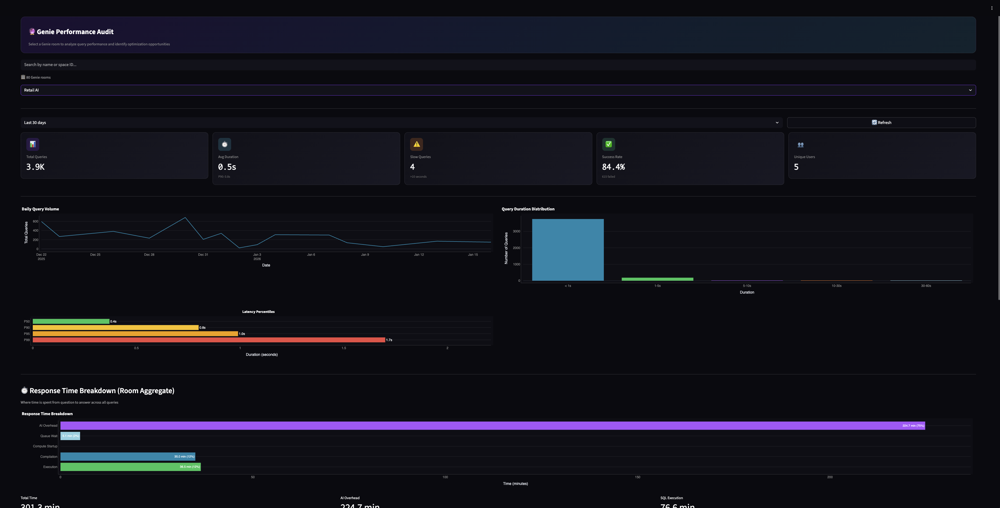
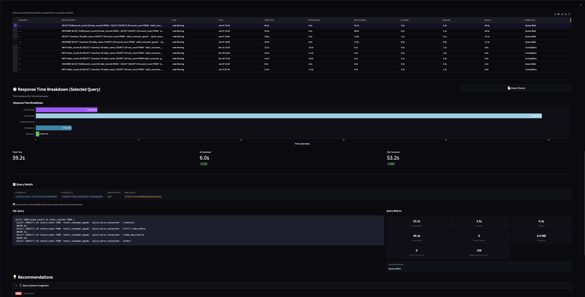

# Genie Performance Audit

A Streamlit application for analyzing Databricks Genie query performance, identifying bottlenecks, and providing actionable optimization recommendations.

## Purpose

This application helps data teams understand and optimize the performance of their Databricks Genie AI assistant. By analyzing query execution patterns, response times, and bottlenecks, teams can:

- **Identify slow queries** impacting user experience
- **Understand AI overhead** vs SQL execution time
- **Pinpoint infrastructure bottlenecks** (warehouse sizing, queue wait, compute startup)
- **Track usage patterns** across Genie rooms and users
- **Generate actionable reports** for engineering teams

## Screenshots

### Genie Room Metrics


### Query Metrics


## Key Metrics

### Room-Level Metrics

| Metric | Description |
|--------|-------------|
| **Total Queries** | Number of queries executed in the Genie room |
| **Avg Duration** | Average query execution time |
| **P50/P90/P95/P99** | Latency percentiles for understanding tail latency |
| **Slow Queries** | Count of queries exceeding 10 seconds |
| **Success Rate** | Percentage of queries that completed successfully |
| **Unique Users** | Number of distinct users querying the room |

### Response Time Breakdown

The application breaks down total response time into distinct phases:

| Phase | Description |
|-------|-------------|
| **AI Processing** | Time from user message to SQL generation (Genie AI overhead) |
| **Queue Wait** | Time waiting for warehouse capacity |
| **Compute Startup** | Time for serverless compute to start |
| **Compilation** | SQL parsing and query planning time |
| **Execution** | Actual query execution time |

### Bottleneck Classification

Queries are automatically classified by their primary bottleneck:

| Bottleneck | Criteria | Recommendation |
|------------|----------|----------------|
| **Compute Startup** | >50% of time in compute startup | Enable serverless warm pools or use provisioned compute |
| **Queue Wait** | >30% of time waiting for capacity | Scale warehouse or optimize concurrency |
| **Compilation** | >40% of time in compilation | Simplify complex queries, reduce joins |
| **Large Scan** | >1GB data scanned | Add filters, use partitioning, create materialized views |
| **Slow Execution** | >10s execution time | Optimize query, add indexes, review query plan |
| **AI Processing** | High AI overhead | Expected for complex NL queries; monitor for anomalies |

### Query-Level Metrics

| Metric | Description |
|--------|-------------|
| **Statement ID** | Unique query identifier for debugging |
| **API Request ID** | Genie API correlation ID |
| **Conversation ID** | Genie conversation thread |
| **User Question** | Original natural language prompt (when available) |
| **SQL Query** | Generated SQL statement |
| **Rows Scanned** | Number of rows processed |
| **Data Read** | Amount of data scanned (MB/GB) |
| **Genie Concurrency** | Concurrent Genie queries at submission time |
| **Warehouse Concurrency** | Concurrent warehouse queries at submission time |

## Features

### Room Selection
- Browse all Genie rooms in your workspace
- Rooms owned by current user are highlighted
- Search by room name or space ID

### Performance Analysis
- **Daily Query Volume**: Track query patterns over time
- **Duration Distribution**: Histogram of query execution times
- **Response Time Breakdown**: Stacked bar chart showing time spent in each phase
- **AI Conversation Activity**: Message volume by type (new, follow-up, regenerate)

### Query Investigation
- Interactive query table sorted by duration
- Click any row to see detailed breakdown
- View original user question and generated SQL
- Diagnostic SQL queries for follow-up investigation

### Exportable Reports
- **Room Report**: PDF with aggregate metrics, charts, and top slow queries
- **Query Report**: PDF with detailed timing breakdown and recommendations

## Data Sources

The application queries these Databricks system tables:

| Table | Purpose |
|-------|---------|
| `{catalog}.query.history` | SQL execution metrics, timing, and metadata |
| `{catalog}.access.audit` | Genie API events for AI overhead calculation |

By default, `{catalog}` is `system`. Set the `SYSTEM_CATALOG` environment variable to use a different catalog.

## Prerequisites

- Python 3.10+
- Databricks workspace with:
  - Access to `system.query.history` and `system.access.audit`
  - At least one Genie room with query activity
- Databricks CLI configured (for deployment)

## Local Development

1. Install dependencies:
   ```bash
   uv sync
   ```

2. Set environment variables:
   ```bash
   export DATABRICKS_HOST="https://your-workspace.cloud.databricks.com"
   export DATABRICKS_TOKEN="your-token"
   export DATABRICKS_WAREHOUSE_ID="your-warehouse-id"
   export SYSTEM_CATALOG="system"  # Optional: defaults to "system"
   ```

3. Run locally:
   ```bash
   uv run streamlit run app.py
   ```

## Deployment to Databricks Apps

Deploy using the included script:

```bash
./deploy.sh
```

Or manually with Databricks Asset Bundles:

```bash
databricks bundle validate
databricks bundle deploy
```

## Project Structure

```
genie-audit-streamlit/
├── app.py                     # Main Streamlit application
├── app.yaml                   # Databricks Apps configuration
├── databricks.yml             # Databricks Asset Bundle config
├── pyproject.toml             # Python dependencies (uv)
├── services/
│   ├── databricks_client.py   # WorkspaceClient wrapper & Genie API
│   ├── analytics.py           # Bottleneck classification & recommendations
│   └── report_generator.py    # PDF report generation
├── components/
│   ├── charts.py              # Plotly chart components
│   ├── metrics.py             # Metric card components
│   └── tiles.py               # Room tile grid component
├── queries/
│   └── sql.py                 # SQL queries for system tables
├── utils/
│   └── formatters.py          # Duration, number formatting utilities
├── tests/                     # Unit and integration tests
└── docs/
    └── images/                # Screenshots and documentation images
```

## Configuration

### Environment Variables

| Variable | Required | Default | Description |
|----------|----------|---------|-------------|
| `DATABRICKS_HOST` | Yes (local) | - | Workspace URL |
| `DATABRICKS_TOKEN` | Yes (local) | - | Personal access token |
| `DATABRICKS_WAREHOUSE_ID` | Yes | - | SQL warehouse ID for query execution |
| `SYSTEM_CATALOG` | No | `system` | Catalog containing system tables (`query.history`, `access.audit`) |
| `STREAMLIT_THEME_BASE` | No | `dark` | Streamlit theme (`dark` or `light`) |

### app.yaml
Controls Databricks Apps runtime:
- Streamlit server settings
- Warehouse ID for SQL execution
- System catalog configuration

### databricks.yml
Controls deployment:
- Bundle name and sync paths
- App permissions and user scopes

## License

Internal use only - Databricks/Albertsons
